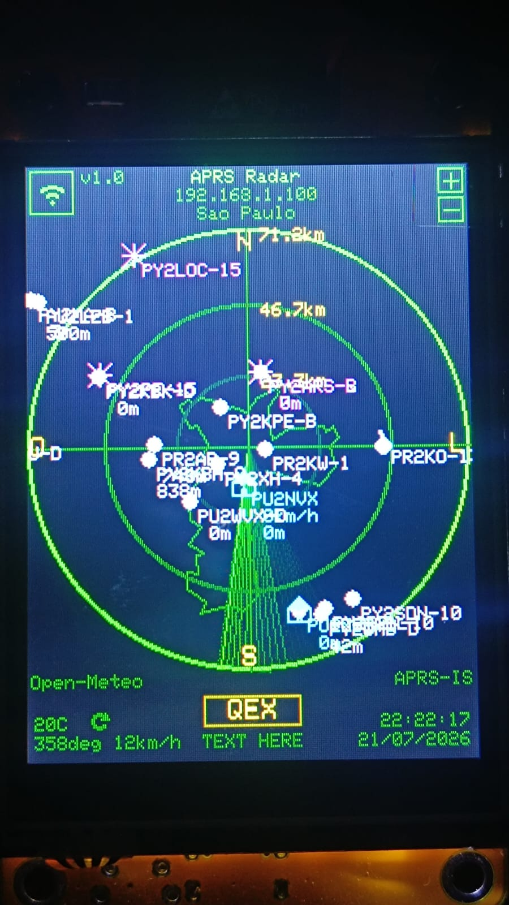
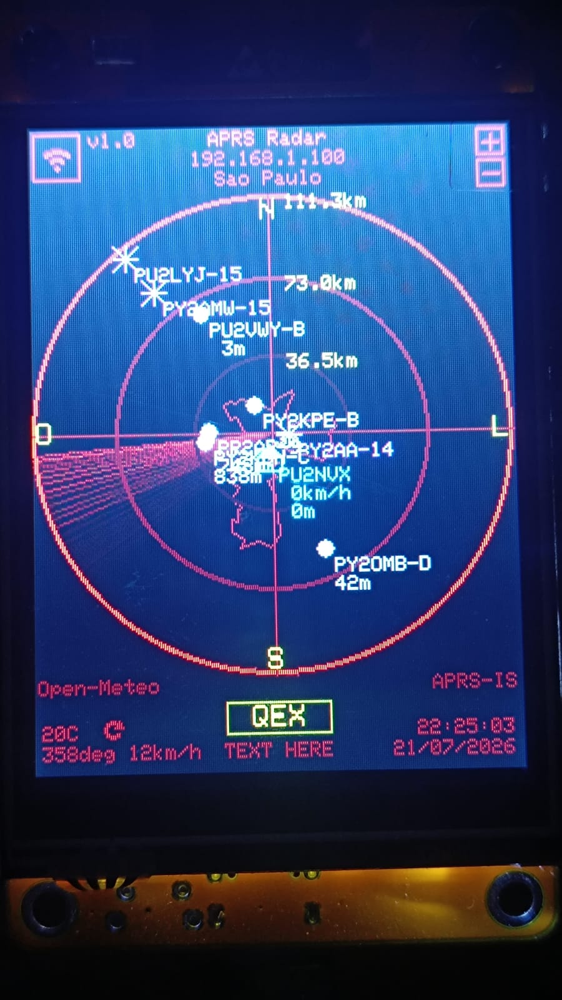

# Micro Radar APRS — Instalador

Rastreador de estações **APRS** (rádio amador) em tempo real para a placa **ESP32 CYD**
(ESP32-2432S028R), lendo posição e tipo de estação direto do **APRS-IS** via TCP.
Este repositório contém apenas o **firmware compilado e o instalador** — não é
preciso VSCode, PlatformIO nem Python para gravar a placa.

  
  &nbsp;&nbsp;
  

## Instalar pelo navegador (recomendado)

👉 **https://rodrigoux.github.io/micro-radar-aprs-install/**

Abra no **Chrome** ou no **Edge**, conecte a placa no USB e clique em
*Conectar e Instalar*. A gravação acontece direto pelo navegador, via Web Serial.

> Firefox e Safari não suportam Web Serial. Nesses casos, use o instalador offline.

## Instalar sem navegador (Windows)

Baixe o [instalador offline](micro_radar_aprs_v1.0_instalador.zip), extraia e execute `gravar.bat`.
Funciona sem internet.

## Depois de gravar

1. Calibre o toque tocando nos cantos indicados na tela.
2. Conecte-se à rede Wi-Fi **MicroRadar-Setup** que a placa cria.
3. Escolha a sua rede Wi-Fi na tela que abrir. A placa reinicia.
4. Abra o IP mostrado na tela para configurar posição do radar, o indicativo/
   passcode/servidor do **APRS-IS**, clima, cor da tela e mais.

## Conteúdo

| Arquivo | O que é |
|---|---|
| `bootloader.bin`, `partitions.bin`, `boot_app0.bin`, `firmware.bin` | As quatro partes do firmware, cada uma gravada no seu endereço (a NVS do usuário fica intacta) |
| `manifest.json` | Manifesto do ESP Web Tools |
| `index.html` | Página do instalador web |
| `micro_radar_aprs_v1.0_instalador.zip` | Instalador offline com `esptool.exe` e `gravar.bat` |

Atualizar **não apaga** suas configurações: Wi-Fi, calibração e os dados do
APRS-IS ficam na NVS e são preservados. (Pela página, deixe a caixa
*"Erase device"* desmarcada.)

*Firmware v1.0. O código-fonte é mantido em um repositório privado.*
